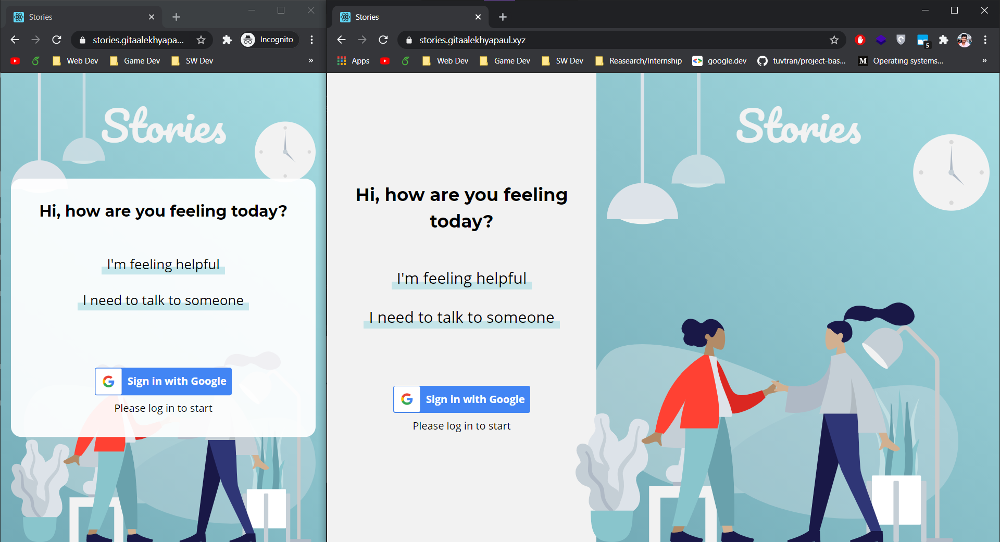
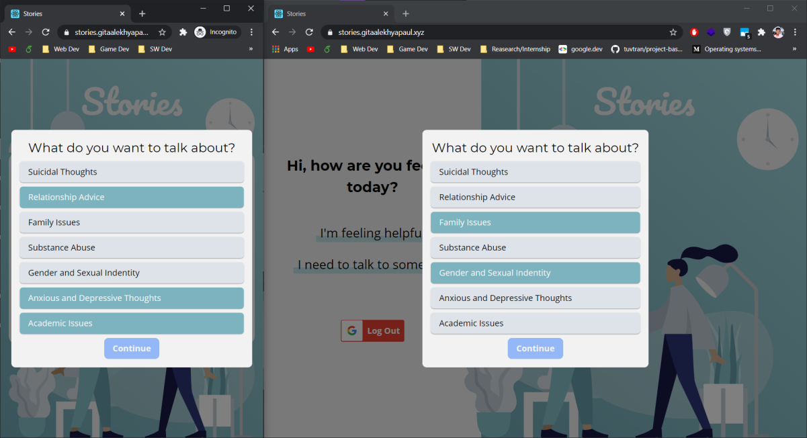
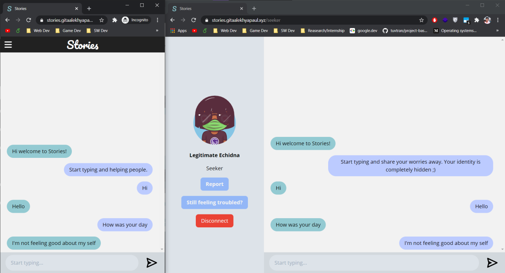
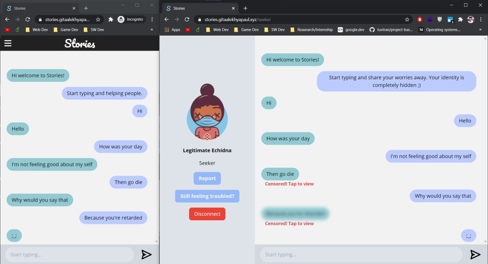
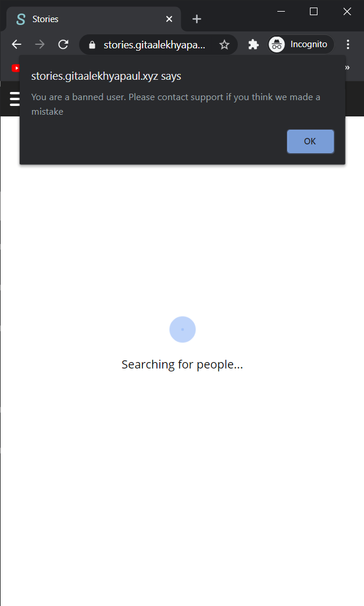

# **Stories** - HackCBS3.0

### Stories from the true you!

---

## A Preview of What Stories Is:

## Landing page:

## Tag Selection

## Chat Window

## Toxicity Censoring

## Banning Reported Users

## The problem Stories solves

> The importance of mental health has been in its rightful spotlight for a while now but many people don't have access to the costly form of therapy. It is well known that people are likely to share their experiences with a stranger rather than an acquaintance due to the fear of being judged. It is a common practice to seek help via online chatrooms. The issue is that these chatrooms are not monitored properly. The rare ones that do, can be easily used against their purpose and push the `seeker` in a worse place.

> This is where our product stories come in. We provide a simplistic chat room that does much more for people who want to provide help and get helped.

## Challenges we ran into

> Implementing a chat room management system along with a banning middleware in Redis was rather difficult. Moreover, implementing authentication with JWT in Socket.io events was a second challenge as far as the web application goes. For the Tensorflow model, we had to fine-tune the model as per our applications, which meant fiddling with the confidence threshold of the output categories to get an optimum solution. It was also pretty tricky to pair the `seeker` & `supporter` based on their tags selection. After pairing them, getting a score based 'compatibility' for the same. And pushing them into the same chatroom based on the score.

## Features offered by Stories

- ### **Google Authentication**
  - Using `G-Auth` as the first layer of authenticity, allowing only verified users on our portal.
- ### **Anonymous Identities**
  - The identities of the `seeker` & the `supporter` are kept hidden from each other to eliminate biases.
- ### **Tags-Selection based pairing**
  - We are maintaining a score between the `supporters` and `seekers`, representing the total number of tags matched. The pair with the highest score is connected to the chatroom.
- ### **Censoring toxic messages**
  - We run the `Tensorflow.js` toxicity classifier on every message sent by the `supporter` to give us the probability of it being toxic. If it is deemed hurtful, the message is censored with a warning on the `seeker`'s end.
- ### **Real-time anaysis of data**
- To ensure real-time analysis of chat data, we use the popular memcache database `Redis` to store the chat room data and client management along with the list of banned users.
- ### **Reporting and banning of users**
  - The `seeker` can report the `supporter` under the circumstances the `supporter` is a troll. Having enough reports file against them, the `supporter`'s email and IP will be banned from our portal.

## Technology Stack and Dependencies

- **APIs**
  - Tensorflow.js
  - Node.js
  - Express in TypeScript
  - Socket.IO
  - Redis
  - Google OAuth
- **Front-end**
  - React.js in TypeScript-XML
  - Tailwind CSS
  - Styled Components
  - Socket.IO - Client

# Thank You!

<h1 align="center"> Contributors </h1>
<table align="center">
<tr align="center">
<td>
<strong>Gita Alekhya Paul</strong>

</td>
<td>
<strong>Snehil</strong>

</td>
</tr>
</table>
<table align="center">
<tr align="center">
<td>
<strong>Paras Rawat</strong>

</td>
<td>
<strong>Yashvardhan Jagnani</strong>

</td>
</tr>
</table>
